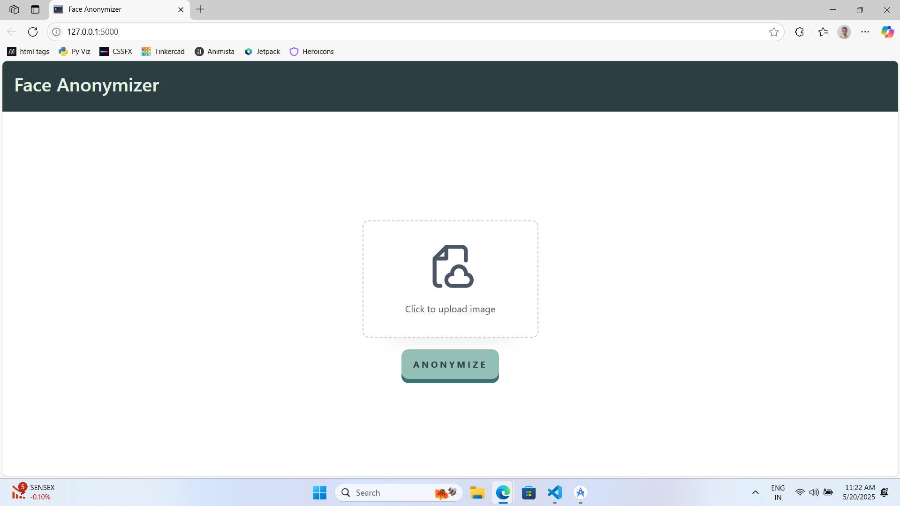
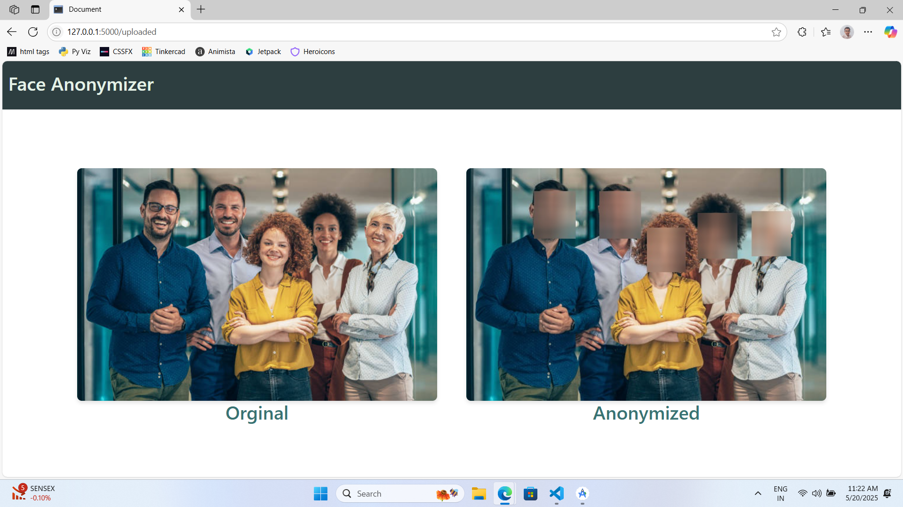

# Face Anonymizer 🕶️

A simple web app built using **HTML**, **CSS**, **Python Flask**, and **OpenCV**. This project identifies faces in an uploaded image and applies a blur effect to anonymize them.


## Features

* Upload an image through the web interface
* Detects human faces using OpenCV’s Haar Cascades
* Automatically blurs all detected faces
* Lightweight Flask backend with a clean front-end UI
* Option to download the anonymized image


## Screenshots

<table border="0">
  <tr>
    <td></td>
    <td></td>
  </tr>
</table>

## How to Download and Use

### 1. Clone the Repository

```bash
git clone https://github.com/Dhineshkumarprakasam/FaceAnonymizer.git
cd FaceAnonymizer
```

### 2. Set Up a Virtual Environment (Optional but Recommended)

```bash
python -m venv venv
source venv/bin/activate   # On Windows: venv\Scripts\activate
```

### 3. Install Dependencies

```bash
pip install -r requirements.txt
```

> Make sure `opencv-python` and `flask` are listed in `requirements.txt`.

### 4. Run the Flask Server

```bash
python app.py
```

Open your browser and go to:
[http://127.0.0.1:5000](http://127.0.0.1:5000)

---

## 📚 Tech Stack

* **Frontend:** HTML + CSS
* **Backend:** Python Flask
* **Face Detection:** OpenCV
